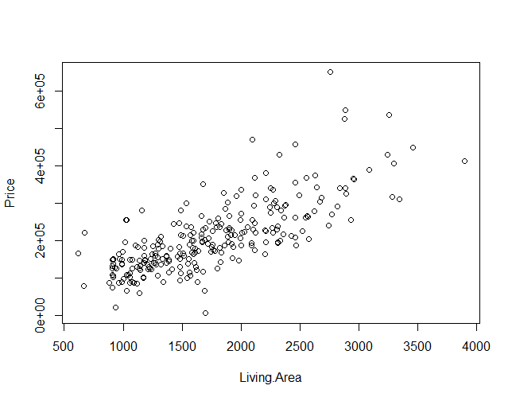

# Note
This project is currently under progress

# House Price Determination

Real estate agents account for many highlighted attributes that contribute to the value of home. Intuitively, it is simple to state that a house’s location is the sole determinant of its value. However, it is not the case because, a home buyer looks for many other things that help themselves to make an informed and rational decision. In this project, I wanted to determine the significance of other variables and find out if these affect a house’s value.

## Introduction

In this project, we aim to examine the significance of a house’s value based on attributes other than its location. In this case, we are predicting the value of a house with the house’s living area. The data is a random sample on thousands on homes located in upstate New York.  

### Scatterplot 
```
real_estate_data = read.csv('real_estate_p.csv')
head(real_estate_data); dim(real_estate_data)

# Scatterplot
plot(Price~Living.Area, data=real_estate_data, xlab="Living.Area", ylab = "Price")

```


There is a straight and moderate positive association between the variable Price and Living.Area with a few outliers.

### Scatterplot With Fitted Regression Line
```
#LS Line
model <- lm(Price~Living.Area, data=real_estate_data); summary(model)
abline(model, col = 'Red')
```


Output:
```
Residuals:
    Min      1Q  Median      3Q     Max 
-198102  -37093   -5874   28992  323947 

Coefficients:
             Estimate Std. Error t value Pr(>|t|)    
(Intercept)  4794.275  11384.935   0.421    0.674    
Living.Area   116.652      6.182  18.870   <2e-16 ***
---
Signif. codes:  
0 ‘***’ 0.001 ‘**’ 0.01 ‘*’ 0.05 ‘.’ 0.1 ‘ ’ 1

Residual standard error: 61580 on 261 degrees of freedom
Multiple R-squared:  0.577,	Adjusted R-squared:  0.5754 
F-statistic: 356.1 on 1 and 261 DF,  p-value: < 2.2e-16
```

In this case, 57.7% proportional variation in Price can be accounted for in the association between Price and Living Area. Given SE is 61580 tells us that the difference between the observed values (Price) and predicted values (Living Area) is large.

## Confidence Interval

```
confint(model, level = 0.95)
```

Output:
```
2.5 %     97.5 %
(Intercept) -17623.7402 27212.2902
Living.Area    104.4794   128.8243

```

### Testing Null Hypothesis

```
t-statistic  = 18.870
p-value = <2e-16
```
Conclusion: The value of B1 is not zero at the level of 0.05 significance. Thus, we reject the null hypothesis because B1 ≠ 0 and we accept the alternative hypothesis instead. 

### Prediction Interval

```
predict(model, data.frame(Living.Area = 1850), level = 0.90, interval = "confidence")

```

Output:
```
fit    lwr      upr
 220600.2 214226 226974.4

```
We are 90% confident that the selling price for a home with 1850 square feet will be between the price range between $214,226 and $226,974.4


### Superimposing 90% Prediction On Scatterplot
```
ci90 = predict(model, newdata = dsata.frame(Living.Area=newx), level = 0.90, interval = "confidence" )
lines(newx, ci90[,2], col="blue"); lines(newx,ci90[,3],col="blue")

```


## Built With

* [R](https://www.r-project.org/) - The programming language used
* [R-Studio](https://www.rstudio.com/) - IDE 

## Authors

* **Isaiah Hong** - *Initial work* - [Github](https://github.com/isaiahhonggitws126)


